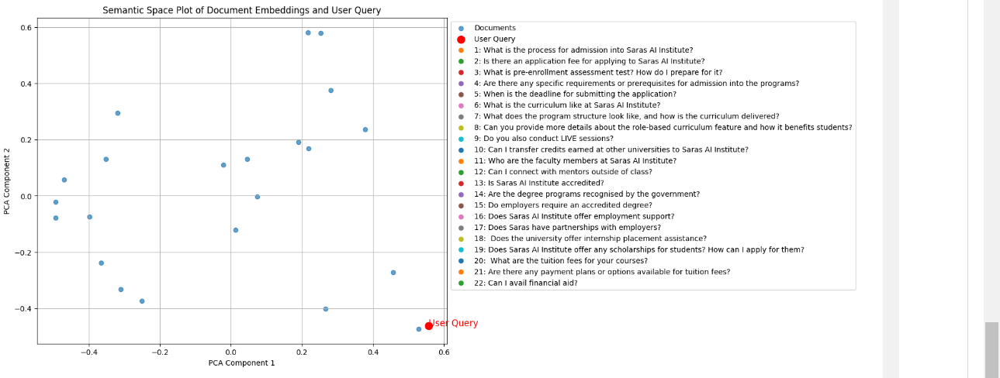

# FAQ Wizard: A Smart FAQ Module for SARAS AI Institute

## Table of Contents

- [Project Overview](#project-overview)
- [Problem Statement](#problem-statement)
- [Features](#features)
- [Technologies Used](#technologies-used)
- [File Structure](#file-structure)
- [Methodology](#methodology)
- [Installation](#installation)
- [Usage](#usage)
- [Deployed App](#deployed-app)
- [Additional Features](#additional-features)
- [Contributing](#contributing)
- [License](#license)

## Project Overview

The FAQ Wizard intelligently returns relevant entries based on user queries for the SARAS AI Institute website. Utilizing advanced NLP techniques like Retrieval Augmented Generation (RAG) and semantic search, it aims to enhance user experience by providing quick and precise answers to common questions, while being adaptable to various datasets.

## Problem Statement

### Hackathon Challenge: Build a Smart FAQ Module

**Objective:**  
Develop a module that can intelligently interpret user queries and return relevant FAQ responses, aiming to enhance user engagement and satisfaction through precise and immediate answers on the SARAS AI Institute website.

## Features

- **Intelligent Search:** Uses semantic search to find relevant FAQ entries based on user input, leveraging embeddings for accurate retrieval.
- **Quick Response Time:** Optimized for rapid responses to ensure a seamless experience.
- **User-Friendly Interface:** Provides an interactive front-end using Streamlit for easy interaction.
- **Personalized Suggestions:** Offers question suggestions on the sidebar based on recent queries for a personalized experience.
- **Resilient to Junk Queries:** Handles irrelevant queries gracefully, redirecting users to ask about relevant topics.
- **Integration-Ready:** Easily adaptable for deployment on the SARAS AI Institute website or other similar platforms.

## Technologies Used

- **Python**: Core language used for development.
- **Streamlit**: Framework for creating the web interface.
- **FAISS (Facebook AI Similarity Search)**: Provides fast and efficient similarity search for embedding-based retrieval.
- **Sentence Transformers**: Generates high-dimensional embeddings from FAQ entries using transformer-based models.
- **LangChain**: Facilitates integration with large language model (LLM) APIs for advanced query processing.
- **JSON**: Used for structured storage of FAQ data.
- **scikit-learn**: Used for Principal Component Analysis (PCA) to visualize embeddings in lower dimensions.

## File Structure

```plaintext
.
├── .gitignore
├── README.md
├── app.py
├── app_streamlitcloud.py
├── documents.pkl
├── faiss_index.index
├── faqs.json
├── requirements.txt
├── rag.ipynb
├── LICENSE
└── assets/
    ├── demo.mp4
    └── semantic_space.png
```

- **`.gitignore`**: Excludes sensitive and unnecessary files from version control.
- **`README.md`**: Project documentation.
- **`app.py`**: The main application code for running the Streamlit app locally.
- **`app_streamlitcloud.py`**: Adapted version for deployment on Streamlit Cloud, using `st.secrets` for secure API key management.
- **`documents.pkl`**: Contains precomputed document embeddings for fast access.
- **`faiss_index.index`**: FAISS index file used for similarity search.
- **`faqs.json`**: Stores FAQ data in a structured format for processing.
- **`requirements.txt`**: Lists Python dependencies required for the project.
- **`rag.ipynb`**: Jupyter notebook for experimentation, visualization, and code testing for RAG.
- **`assets/`**: Contains multimedia files used for demonstration and visualizations.

## Methodology

### 1. Data Preparation

- FAQ data is stored in `faqs.json` in a question-answer format.
- Sentence Transformers are used to generate embeddings for each FAQ entry.

### 2. Embeddings Generation

- Sentence Transformers convert FAQ entries and user queries into high-dimensional vector embeddings.
- Embeddings capture the semantic meaning of texts, enabling effective matching of user queries to relevant FAQ responses.

### 3. Indexing with FAISS

- FAISS indexes the embeddings for efficient similarity search.
- Instead of chunking text, embeddings are indexed as whole vectors to improve search precision and response time.
- The FAISS index allows for quick nearest-neighbor search to retrieve the most relevant FAQs.

### 4. Query Processing

- User input is transformed into an embedding using Sentence Transformers.
- The embedding is compared against the FAISS index to find the closest matches.
- The top-N most similar FAQ entries are retrieved based on cosine similarity.

### 5. Visualization and Testing

- `rag.ipynb` provides tools for visualizing embeddings using PCA.
- A semantic space illustration (`assets/semantic_space.png`) shows how closely the embeddings match the user query.

## Installation

1. **Clone the repository:**

   ```bash
   git clone https://github.com/sakshikumar19/SARCathon-Smart-FAQ-Module.git
   cd smart-faq-module
   ```

2. **Install dependencies:**

   ```bash
   pip install -r requirements.txt
   ```

3. **Run the application locally:**
   ```bash
   streamlit run app.py
   ```

## Usage

1. **Launch the Streamlit app locally or access the deployed version (see below).**
2. **Enter a query in the search bar.**
3. **Receive relevant FAQ responses based on the semantic similarity of the query.**
4. **Click on suggested questions on the sidebar to explore related FAQs.**
5. **The app is designed to handle irrelevant inputs by gently guiding users to ask appropriate questions about SARAS AI.**

## Deployed App

Access the live deployment [here](https://faq--wizard.streamlit.app/).

## Additional Features

- **Video Demonstration:**
  - [Watch the demonstration here](https://drive.google.com/file/d/145NhAc8m-oyBF9zYah1osREC3ldlrJbM/view?usp=drivesdk).
- **Semantic Space Illustration:**
  -  visualizes how embeddings represent the FAQ data and queries in a lower-dimensional space.

For testing with different datasets, modify `faqs.json` and run `rag.ipynb` to regenerate the FAISS index and embeddings (`documents.pkl`). This makes the project highly scalable and adaptable.

## License

This project is licensed under the MIT License. See the [LICENSE](LICENSE) file for more details.
